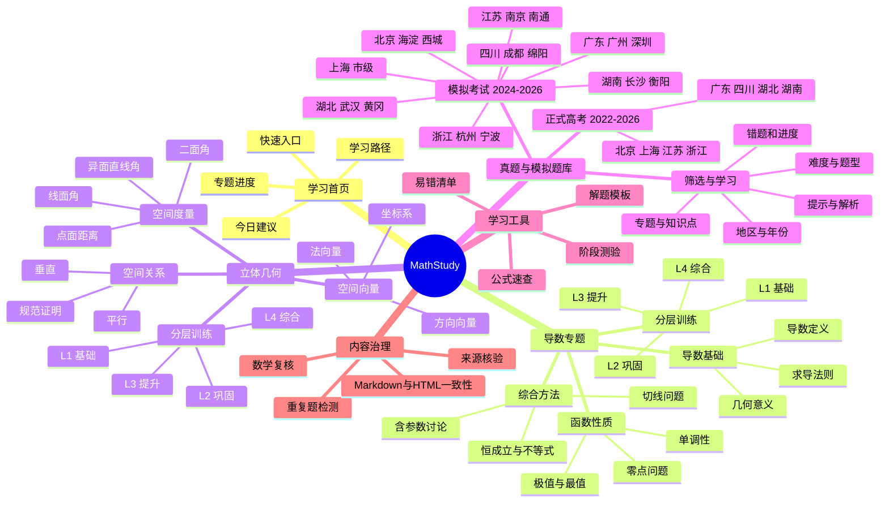

# MathStudy 开发计划

## 1. 项目目标

建立一个以北京新高考考点体系为主、兼顾不同基础学生的数学学习站。首期聚焦“导数”和“立体几何”，同时提供系统讲义、分层例题、练习、详细解析与可筛选题库。

内容以 Markdown 为唯一稿源，HTML 负责交互展示；数学公式使用 MathJax，在线加载优先，并在后续里程碑中加入离线资源。

## 2. 网站脑图

## 3. 信息架构

| 一级页面 | 主要内容 | 首版状态 |
| --- | --- | --- |
| 首页 | 专题入口、学习路线、建设进度 | 已创建 |
| 导数专题 | 知识地图与章节入口 | 已创建 |
| 单调性示范课 | 讲解、例题、易错点、练习 | 已创建 |
| 立体几何专题 | 知识地图与章节入口 | 已创建 |
| 二面角示范课 | 向量法流程、例题与练习 | 已创建 |
| 题库 | 多维筛选、答案折叠、来源状态 | 原型已创建 |
| 公式速查 | 导数公式、空间向量公式 | 待开发 |
| 学习记录 | 已完成、错题、收藏 | 待开发 |

## 4. 内容规范

每个完整章节依次包含：学习目标、前置诊断、核心知识、方法步骤、分层例题、易错提醒、分层练习、答案解析和本节总结。难度统一使用 L1（基础）、L2（巩固）、L3（提升）、L4（综合）。

题目必须记录年份、地区、考试层级、考试名称、题号、专题、知识点、难度和来源核验状态。正式题目未完成来源核验前不得标记为真题；商业教辅解析不得复制进入项目。

## 5. 里程碑

1. **M1 基础框架**：响应式首页、导航、专题页、MathJax、打印样式。
2. **M2 内容样板**：完成“导数与单调性”和“向量法求二面角”。
3. **M3 题库原型**：筛选、答案折叠、来源标签、本地学习状态。
4. **M4 完整专题**：补齐导数与立体几何全部章节。
5. **M5 题库建设**：先正式高考，后省级与指定城市模拟；逐题核验与复核。
6. **M6 发布质量**：离线 MathJax、链接检查、公式检查、无障碍、移动端和 GitHub Pages。

## 6. 验收标准

- 手机和桌面端均可读，键盘可完成主要操作。
- 公式正确渲染；MathJax 不可用时仍保留可读的 LaTeX 文本。
- 所有章节入口无死链，打印时隐藏导航和交互按钮。
- 每道来源题具有可追溯信息，每份解析至少经过一次独立数学复核。
- Markdown 稿源与公开页面的定义、题目和答案保持一致。
